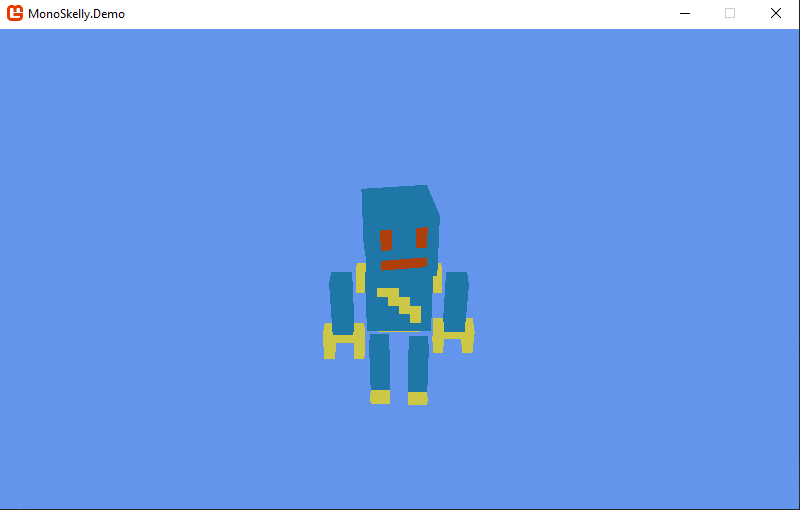
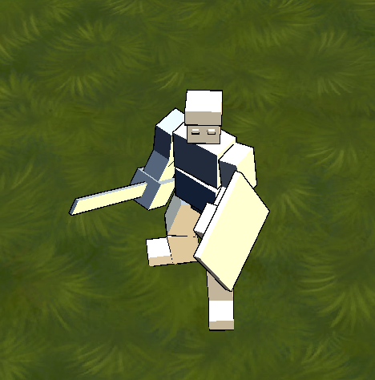
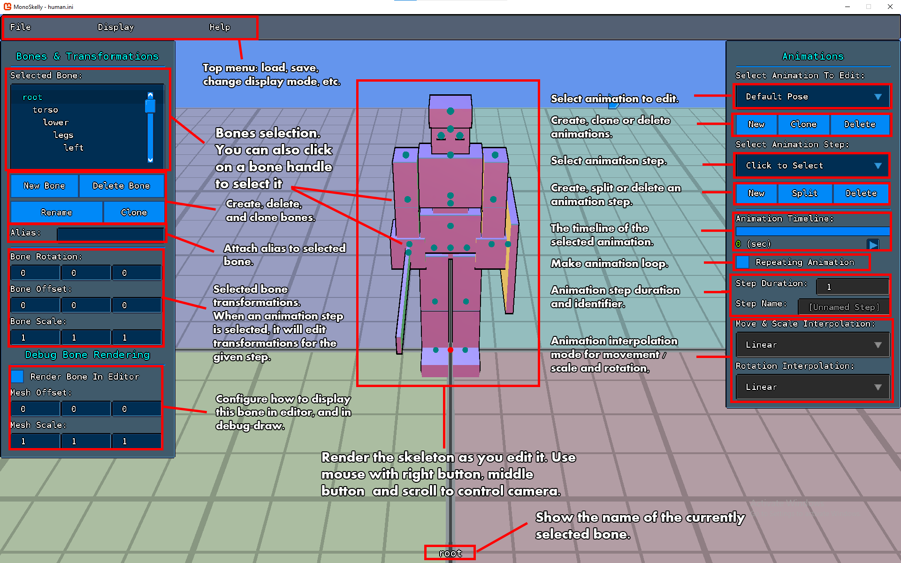
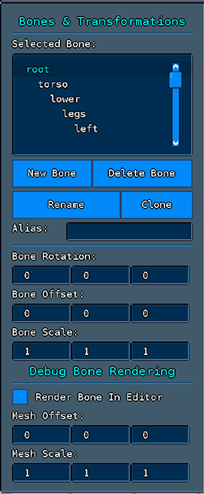
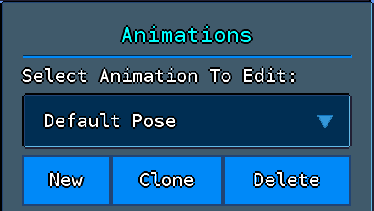
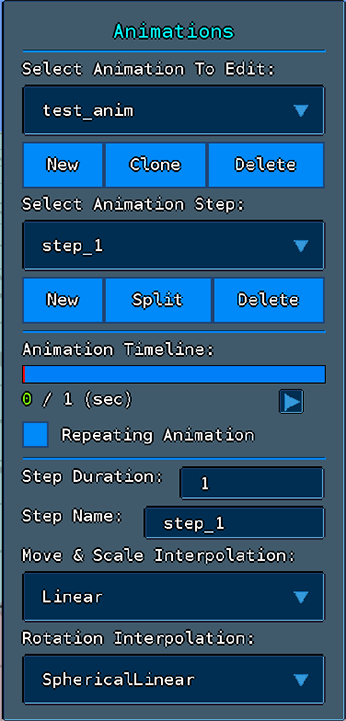

# MonoSkelly

*MonoSkelly* is a library + editor + file format for skeleton-based animations in *MonoGame*. 
It implements a complete animation system as a new set of classes, decoupled and independent of *MonoGame*'s Models and Content Manager.


To use *MonoSkelly*: 

- Open the Skelly Editor (included in this repository). 
- Build a skeleton from an hierarchy of bones (a bone = offset + scale + rotation from parent bone). 
- Define animations by setting key poses to interpolate between.
- Save the skeleton file, which you will later use in your game with the *MonoSkelly.Core* library. 

Using *MonoSkelly* is quite simple too. Start animation sequence, update with delta-time every frame, and query bone transformations to use with your 3d models.

In addition to the editor, this repository contains a demo project you can check out. It renders a player character with simple model transformations, ie without weights, similar to how early 3d games where made. 


### Table Of Contents

- [Installation](#installation)
- [Projects In Repository](#projects-in-repository)
- [How To Use](#usage)
- [Editor](#editor)
- [API](#api)
- [File Format](#file-format)
- [License](#license)


# Installation

To use *MonoSkelly*, fetch the [NuGet Package](https://www.nuget.org/packages/MonoSkelly/) with the NuGet manager, or by running the following command in Visual Studio:

```
Install-Package MonoSkelly
```

You can also clone the repo and build the projects yourself.


# Projects In Repository

This repository contains three projects:

## MonoSkelly.Core

The library itself, which is the dll you get from the NuGet and everything you need to use *MonoSkelly* in your game or applications.

## MonoSkelly.Demo

A demo project that illustrate how to use *MonoSkelly*. 

It animates a simple fighter model with sword and shield that can walk around and attack. 
It doesn't use weights and all calculations are done on CPU.


## MonoSkelly.Editor

An editor program (exe) to create and animate skeletons. 
It comes with an example human skeleton you can load and play with.

The editor is open source, so you can incorporate it in your own projects or modify it to better suit your needs.


# Usage

In this section we'll learn how to use *MonoSkelly* via the package API. 

If you want to learn more about the *editing* API and not just how to play animations (for example if you want to generate animations at runtime), check out the editor source code or read the details in the [API](#api) section.

## Basic Example

Let's take a look at a basic example on how to use *MonoSkelly*. 

Please create an empty *MonoGame* project and add the *MonoSkelly* NuGet package to it. Then, copy the content folder from `MonoSkelly.Demo/Content/tutorial` and add it to your own project content. This will provide you with a basic skeleton animation and models we'll use in this example.

Be sure to set 'robot.ini' build action to just 'Copy', as this file is not meant to be built.

At the end of the example, you should have a little dancing robot that looks something like this:



Yes, it's incredible. I know.

Now to the code! Add the following members to your Game class:

```cs
// camera for view & projection metrices
MonoSkelly.Core.Camera _camera;

// player models (body parts, key = bone alias)
Dictionary<string, Model> _playerParts;

// player skeleton and active animation
MonoSkelly.Core.Skeleton _playerSkeleton;
MonoSkelly.Core.AnimationState _animation;
```

And let's start by loading the models we'll use to render the robot with. Note that the keys in this dictionary match the aliases defined in the skeleton file, so model "head" will be attached to bone "head", model "body" to bone "body", etc.

```cs
protected override void LoadContent()
{
    // load player models
    _playerParts = new Dictionary<string, Model>();
    _playerParts["head"] = Content.Load<Model>("tutorial/head");
    _playerParts["body"] = Content.Load<Model>("tutorial/body");
    _playerParts["arm_left"] = Content.Load<Model>("tutorial/arm");
    _playerParts["arm_right"] = Content.Load<Model>("tutorial/arm");
    _playerParts["leg_left"] = Content.Load<Model>("tutorial/leg");
    _playerParts["leg_right"] = Content.Load<Model>("tutorial/leg");

    // fix models base transform (messed up in export)
    foreach (var model in _playerParts)
    {
        model.Value.Root.Transform = Matrix.CreateRotationY(MathHelper.Pi / 2);
    }
}
```

We'll also create a camera, which is a utility class provided by *MonoSkelly* to help us build the View and Projection matrices:

```cs
_camera = new MonoSkelly.Core.Camera(_graphics);
```

And now to load our skeleton animations, we'll add the following code:

```cs
_playerSkeleton = new MonoSkelly.Core.Skeleton();
_playerSkeleton.LoadFrom("Content/tutorial/robot.ini");
```

And finally, we'll create an animation instance to play the 'idle' animation:

```cs
MonoSkelly.Core.AnimationState _animation = _playerSkeleton.BeginAnimation("idle");
```

That's it, the stage is now set for rendering.
Let's write our Draw() method:

```cs
protected override void Draw(GameTime gameTime)
{
    GraphicsDevice.Clear(Color.CornflowerBlue);

    // update camera
    _camera.LookAt = new Vector3(0, 15, 0);
    _camera.Position = new Vector3(0, 45, -45);
    _camera.Update();

    // advance animation by 'deltaTime' (usually can be gameTime.ElapsedGameTime.TotalSeconds)
    _animation.Update((float)gameTime.ElapsedGameTime.TotalSeconds);

    // player world model (you can translate this to move player around)
    var playerWorldMatrix = Matrix.Identity;

    // now draw the player models
    foreach (var part in _playerParts)
    {
        var bone = _animation.GetBoneTransform(part.Key);
        part.Value.Draw(bone * playerWorldMatrix, _camera.View, _camera.Projection);
    }

    base.Draw(gameTime);
}
```

And if the skeleton and models are properly set, you can see the robot playing the idle animation!

#### Update & GetBoneTransform

There are two key methods to note in the code above: 

`animation.Update` is the method we use to advance the animation by a delta time every frame. It also has an overload method with additional out parameters, which provides extra information like how many steps were passed, and whether or not we finished the animation cycle in this frame.

`animation.GetBoneTransform` is what we use to query the bones transformations, and we use these matrices with our models to animate them.

`GetBoneTransform()` can either accept the bone's full path (for example, `root/torso/arms/upper_arm`), or the bone alias, if defined.

### Full Code

In case your code didn't work, you can compare it to the following full example code, also found in `MonoSkelly.Demo/UsageExampleCode.cs`:

```cs
internal class UsageExampleCode : Game
{
    private GraphicsDeviceManager _graphics;

    // camera for view & projection metrices
    MonoSkelly.Core.Camera _camera;

    // player models (body parts, key = bone alias)
    Dictionary<string, Model> _playerParts;

    // player skeleton and active animation
    MonoSkelly.Core.Skeleton _playerSkeleton;
    MonoSkelly.Core.AnimationState _animation;

    public UsageExampleCode()
    {
        _graphics = new GraphicsDeviceManager(this);
        Content.RootDirectory = "Content";
        IsMouseVisible = true;
    }

    protected override void Initialize()
    {
        _camera = new Core.Camera(_graphics);
        base.Initialize();
    }

    protected override void LoadContent()
    {
        // load player models
        _playerParts = new Dictionary<string, Model>();
        _playerParts["head"] = Content.Load<Model>("tutorial/head");
        _playerParts["body"] = Content.Load<Model>("tutorial/body");
        _playerParts["arm_left"] = Content.Load<Model>("tutorial/arm");
        _playerParts["arm_right"] = Content.Load<Model>("tutorial/arm");
        _playerParts["leg_left"] = Content.Load<Model>("tutorial/leg");
        _playerParts["leg_right"] = Content.Load<Model>("tutorial/leg");

        // fix models base transform (messed up in export)
        foreach (var model in _playerParts)
        {
            model.Value.Root.Transform = Matrix.CreateRotationY(MathHelper.Pi / 2);
        }

        // load skeleton and init animation
        _playerSkeleton = new MonoSkelly.Core.Skeleton();
        _playerSkeleton.LoadFrom("Content/tutorial/robot.ini");
        _animation = _playerSkeleton.BeginAnimation("idle");
    }

    protected override void Update(GameTime gameTime)
    {
        if (GamePad.GetState(PlayerIndex.One).Buttons.Back == ButtonState.Pressed || Keyboard.GetState().IsKeyDown(Keys.Escape))
            Exit();

        base.Update(gameTime);
    }

    protected override void Draw(GameTime gameTime)
    {
        GraphicsDevice.Clear(Color.CornflowerBlue);

        // update camera
        _camera.LookAt = new Vector3(0, 15, 0);
        _camera.Position = new Vector3(0, 45, -45);
        _camera.Update();

        // advance animation by 'deltaTime' (usually can be gameTime.ElapsedGameTime.TotalSeconds)
        _animation.Update((float)gameTime.ElapsedGameTime.TotalSeconds);

        // player world model (you can translate this to move player around)
        var playerWorldMatrix = Matrix.Identity;

        // now draw the player models
        foreach (var part in _playerParts)
        {
            var bone = _animation.GetBoneTransform(part.Key);
            part.Value.Draw(bone * playerWorldMatrix, _camera.View, _camera.Projection);
        }

        base.Draw(gameTime);
    }
}
```

## Changing Animations

Say your player now attacks, and you want to render the attacking animation. 

To do so, we just need to change our animation state to the 'attack' animation (note: the robot skeleton **does not** come with an attack animation, so you need to build one yourself first):

```cs
_animation = _playerSkeleton.BeginAnimation("attack");
```

And when done, we can switch back to idle:

```cs
_animation = _playerSkeleton.BeginAnimation("idle");
```

### Blending Animations

If you tried switching between animations, you probably noticed that something's not right. 

While both animations play smoothly, the transition between them is not. Every time a new animation starts, the bones 'jump' to the start pose of the new animation.

That's because in order to get a smooth transition between animations, you need to *blend them*. Animation blending is not unique to *MonoSkelly*, it's a common practice in 3d graphics, in which we lerp the transformations from one animation to the next, usually while playing both.

To blend animations, *MonoSkelly* offers a helper class called *AnimationsBlender*. Lets take a look on how we use it:

```cs
var idleAnimation = _playerSkeleton.BeginAnimation("idle");
var attackAnimation = _playerSkeleton.BeginAnimation("attack");
_animationsBlender = new MonoSkelly.Core.AnimationsBlender(idleAnimation, attackAnimation);
```

And now when you draw your models, instead of using the animation state, use the blender:

```cs
// advance animation by 'deltaTime' (usually can be gameTime.ElapsedGameTime.TotalSeconds)
_animationsBlender.Update(deltaTime);

// advance the transition from 'idle' to 'attack' (0 = idle animation, 1 = attack)
_animationsBlender.BlendFactor += deltaTime;

// draw the player models
foreach (var part in _playerParts)
{
    var bone = _animationsBlender.GetBoneTransform(part.Key);  // <-- will return blended transformations between the animations
    part.Value.Draw(bone * playerWorldMatrix, _camera.View, _camera.Projection);
}
```

## Aliases & Paths

Normally, bones are identified by their full path, meaning that if you have the following bones hierarchy: root -> body -> left -> arm, the arm bone will be identified as `root/body/left/arm`. That way you can have both `root/body/left/arm` and `root/body/right/arm` without having a collision on the `arm` bone name. 

Full paths are even more useful as your hierarchy grows deeper, for example if you have `root/body/left/arm/palm/fingers/...` and you want to have 'arm', 'palm' and same set of fingers on both sides. 

However, using full paths is not always comfortable, as it creates an unwanted coupling between the skeleton structure and your code. What if you want to use a slightly modified skeleton, that has a `torso` bone between `body` and `left`? Now your path is `root/body/torso/left/arm`, and you need to change your code accordingly.

Aliases solve exactly that, by decoupling the code from the skeleton. 

In essense, an alias is a short unique name you can attach to a bone and later use in code, without knowing the bone actual path.

In the example above we would attach the alias `left_arm` to `root/body/left/arm` and `right_arm` to `root/body/right/arm`. That way we can render both arms without knowing the structure, the only requirement is that the skeleton will have have a 'left_arm' and 'right_arm' bones. 

When possible, always prefer to use aliases over full paths. 
It will also make it easier for players to mod your game, if you desire that.


## Debug Drawing Skeleton

For debug purposes, you can draw the skeleton itself. First, you need to set a model to use when drawing bones:

```cs
MonoSkelly.Core.Skeleton.SetDebugModels(null, Content.Load<Model>("bone"), null);
```

Now we can draw the skeleton (we'll draw 'idle' animation with elapsed time of '_animationProgress'):

```cs
_playerSkeleton.DebugDrawBones(_camera.View, _camera.Projection, playerWorldMatrix, "idle", _animationProgress, true, null);
```



Note that drawing bones don't happen automatically, you need to set which bones to draw and how to draw them in the editor. More on that later.

# Editor

**A warning before we begin!** - at the time of writing these lines the editor is still very new and not tested enough. Please for the love of god, **save your file** as often as possible.

Lets explore the editor for a little bit, to learn how to make animations. 

Try to build and run the Editor project. When opened, you should see the following layout (note: in this example we also loaded the sample skeleton 'human.ini'):



Start a new project, and lets build something!

## 1. Making The Skeleton

First step is to define your skeleton in it's default pose. 

Use the 'New Bone' button (from the left panel) to create a new bone and build your skeleton structure. Use the bone transformations to move, scale and rotate the bones (usually you only need rotation and offset, scale is only if you want to scale models while animating them).



Its a common practice to define the default pose as the famous "T-Pose", but its not mandatory with *MonoSkelly*.

Note that bones will not be visible in editor like in the layout screenshot. Instead you'll only see a small sphere representing the bone's origin point (aka 'handle').

To add a bone display model, check the 'Render Bone In Editor' and define its scale and offset to match the models you actually want to use in-game.


## 2. Create an Animation

Let's create an animation with the new animation button on the animations panel (usually on the right):



After creating an animation select it, and add a step by clicking on the new step button. Give it any name, or leave empty. 
Step names are not mandatory, but they are useful for clarity, and you can use them to trigger stuff while playing the animation in your game (for example you can set a step called 'attack_strike' that represent the actual hit, and only deliver damage when reach it).

Once you have a valid animation selected and there's at least one step in it, the rest of the animation panel options will unlock and become interactable:



Note the little play button under the timeline. You can click it to play the animation, but since you only have one step and didn't change any bone yet, clicking it now won't do much.

You can now start working on your animation by moving the bones to the pose you want while the step is selected. Then add another step and create a new pose, until you define all the key poses of your animation. When playing it, *MonoSkelly* will interpolate transformations between the poses you defined.

Note that every step has a 'duration' property. If a step duration is 1.0 seconds, for example, it means that *MonoSkelly* will take exactly one second to interpolate between the begining of this step and the bones transformations of the next step.

If your timeline points on an interpolated frame (ie between steps), the transformations panel will be locked, as you can't edit bones between steps. You can use the steps selection dropdown to quickly go back to one of the valid steps.

## 3. Save Your Skeleton

When you finish your animations save your skeleton via the 'File' menu at the top-left corner. Output file will appear in the saves folder, and you can copy it to your project folder and load it with the LoadFrom() API.

That's it! You should now know how to use the Editor to create animations, and then use and blend them in your game. This would be a good time to check the demo project in depth, or to proceed to the API section in this doc.


# API

This section describe the main classes and their API. This does not cover everything, only the main classes and members you'll be using most of the time. For the full API, its best to check the code itself.

If you jumped here before reading the [How To Use](#usage) section, its best to go back to the basic example first.

## Transformation

A helper class to define bone's transformations (position, scale, rotation) and convert it to a matrix.

## Skeleton

This is the main class we use in *MonoSkelly*. 
Note that a Skeleton does not represent an instance, but a type. Ie you won't have a skeleton instance per enemy instance, but you'll probably have a Skeleton per enemy model type, which will be used to animate all the enemies that use that model.

Lets explore the Skeleton's main methods:

### static SetDebugModels

Set the models to use for bones and handles display while in editor / debug draw.

### BeginAnimation

Return an AnimationState instance to start playing a new animation.
This is what you use to animate the skeleton.

### SetAlias

Set a bone alias.

### HaveAlias

Check if this Skeleton contains an alias. 

You can use this to decide if to render a helmet, for example, based on whether or not the given skeleton contains an alias called "head_gear".

### SetTransform

Set the default pose bones transformation.

### SaveTo

Save Skeleton to file.

### LoadFrom

Load Skeleton from file.

### AddBone

Define a new bone.

### DebugDrawBones

Draw the skeleton bones, using the models you set with `SetDebugModels`.

### DebugDrawBoneHandles

Draw the skeleton bone handles, using the models you set with `SetDebugModels`.

### GetWorldMatrix

A quick and dirty way to get a bone transformation. Best not to use this in production.

## AnimationState

A running animation instance. Use this to animate models and query bones.

### Reset

Reset animation back to start.

### GetBoneTransform

Get bone transformations.

### Update

Updates the animation. 
You must call this with delta time to progress the animation.

### Repeats

Set if this animation will repeat itself in a cycle.

### Name

Get animation name.


## AnimationsBlender

A utility class to blend two animations together.

### BlendFrom

Animation to blend from.

### BlendTo

Animation to blend to.

### BlendFactor

Blending factor (0.0 - 1.0) between the animations.
- 0.0 = 100% BlendFrom weight, 0% BlendTo weight.
- 1.0 = 0% BlendFrom weight, 100% BlendTo weight.

### OnAnimationDone

Optional callback that will be called whenever an animation finishes a cycle.

### Switch

Switch 'from' and 'to' animations.

### GetBoneTransform

Get bone transformations, blended between the animations based on factor.

### Update

Update both animations by delta time, without changing blending factor. 
You need to update the blending factor separately.

## Camera

A utility class to help us build View and Projection matrices.

### Update

Rebuild the View and Projection matrices.

### ForceScreenSize

If set, will use this as screen size instead of querying the graphic device.

### CameraType

Select camera type (Perspective / Orthographic).

### FieldOfView

Set FOV.

### NearClipPlane / FarClipPlane

Set near and far clip planes.

### LookAt

Optional lookat vector.

### Position

Camera position.

### UpVector

Camera up vector.

### Rotation

Camera rotation on X and Y axis. Only works if LookAt is null.

### Projection

Get the Projection matrix.

### View

Get the View matrix.

### ViewProjection

Get the View * Projection matrix.

### ViewFrustum

Get camera view frustum.

### RayFromMouse

Create a ray from mouse position.

### RayFrom3dPoint

Create a ray from 3d point.

### RayFrom2dPoint

Create a ray from 2d point.

# File Format

*MonoSkelly* files are saved as a plaintext ini files. 
It may not be the most efficient format, but it has the advantages of being readable, easy to edit with just notepad, and you can actually compare changes with simple text comparison tools.

Looking at the sample `human.ini` file should tell you everything you need to know about the format, but lets review some of the sections a *MonoSkelly* contains here:

**[bones]**

This section contains all the bones in their default pose. 
Every bone have its path (which also contain its parent), and the bone's transformations (position, scale and rotation).

**[meshes]**

This section contains the meshes we use to display the bones in the editor. Its for debug purposes and editor only.

**[aliases]**

This section contains all the bone aliases. Keys are the alias, values are bone paths.

**[animations]**

This section contains just the names of the animations this skeleton support.
For every animation in the list, we'll have a corresponding `[animation_xxx]` section to describe the animation itself (xxx being animation name).

**[animation_xxx]**

Describe the specific animation sequence. 

For every animation we have few metadata fields, like steps count and if the animation is repeating, and a set of animation steps.

Every animation step contains a list of bones and the transformations to apply on every bone in this step. 
To slightly reduce file size, instead of using bone paths here we use indices, which should match the order in which the bones appear under the `[bones]` section.

# Changes

### 1.0.0.2

- Fixed editor crashing when adding bone to default pose and switching to animation.
- Fixed animation clone to also copy `Repeats` and steps steps interpolation modes.

# License

*MonoSkelly* is distributed under the MIT license, so use it for whatever.


